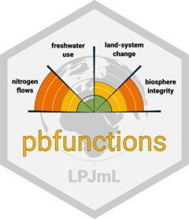

# pbfunctions <a href='https://tidyr.tidyverse.org'></a>


*The goal of pbfunctions is to provide a toolset of functions that can be used   
to calculate and optimize the status of a planetary boundary (PB)  
in connection with [LPJmL](https://gitlab.pik-potsdam.de/lpjml/LPJmL_internal).*

The boundaries considered here are

* **freshwater use**, tag *freshwater*
* **land-system change**, tag *landuse*
* **biosphere integrity**, tag *biosphere*
* **nitrogen flows**, tag *nitrogen*


## Installation

You can install `pbfunctions` by git cloning this repository ...

```bash
git clone https://gitlab.pik-potsdam.de/tess/pbfunctions.git
```

and install via  [`devtools`](https://rawgit.com/rstudio/cheatsheets/master/package-development.pdf) ...
```R
devtools::install("<path_to_pbfunctions>/pbfunctions")

library("pbfunctions")
```

## Scripts

For now this repository also serves as a collection of PB calculation and optimization
scripts that are stored at `./scripts`  


## Example

This is a basic example which shows you how to solve a common problem:

``` r
library(pbfunctions)
## basic example code
```

